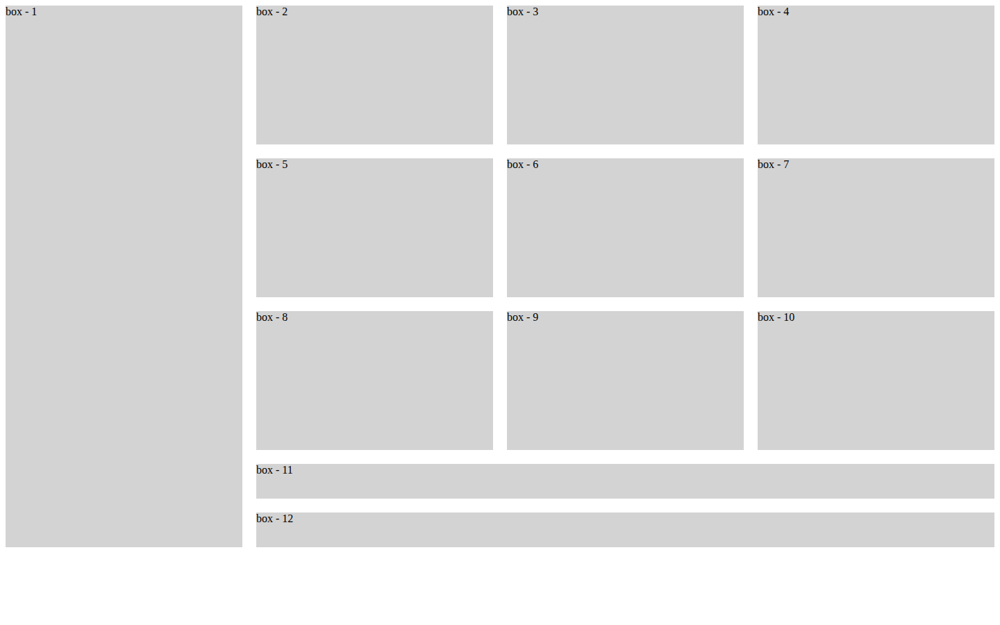

# Using Grid

A CSS Grid exercise: twelve boxes in four columns, where one box spans every row and two boxes span three columns.

**Live page:** <https://shayan-abrar.github.io/Using-Grid/grid>

<p align="center">
  <a href="screenshots/preview.png"></a>
</p>

Grid layouts get interesting when an item covers more than one cell. This page isolates that idea in a few lines of CSS: explicit row heights, a gap and two `span` rules that turn a plain four-column grid into a tall left column and two wide strips. It's a quick way to see how spanning items and auto-placement work together.

## Quick Start

```bash
git clone https://github.com/SHAYAN-ABRAR/Using-Grid.git
cd Using-Grid
python3 -m http.server 8000
```

Open <http://localhost:8000/grid.html>. On Windows, use `python` instead of `python3`. Opening `grid.html` directly in a browser works too, and nothing is loaded from the internet.

## Features

| CSS | Effect |
| --- | --- |
| `grid-template-columns: repeat(4,1fr)` | Four equal-width columns |
| `grid-template-rows: repeat(3, 200px) 50px 50px` | Three 200px rows followed by two 50px rows |
| `gap: 20px` | 20px of space between cells |
| `#box1 { grid-row: span 5; }` | Box 1 fills the first column from top to bottom |
| `#box11, #box12 { grid-column: span 3; }` | Boxes 11 and 12 each fill a 50px row across the other three columns |

Boxes 2 to 10 have no placement rules. The browser's auto-placement fills the three-by-three block next to box 1 with them.

## Usage Example

These are all the layout rules in `grid.html`:

```css
.container{
    display: grid;
    grid-template-columns: repeat(4,1fr);
    grid-template-rows: repeat(3, 200px) 50px 50px;
    gap: 20px;
}
#box1{
    grid-row: span 5;
}
#box11, #box12{
    grid-column: span 3;
}
```

To see auto-placement at work, change `span 5` to `span 3`. Box 1 then stops at the third row, and boxes 11 and 12 slide left into the space below it.

## Limitations

- There are no media queries, so on a phone the four columns just get narrower (about 80px each on a 390px screen).
- The boxes are unstyled placeholders in the browser's default font.

## Tech Stack

- HTML5
- CSS3 Grid, in a `<style>` block in `grid.html`
- Hosted on GitHub Pages

## Contributing

This is a small practice exercise, but suggestions and bug reports are welcome. Please [open an issue](https://github.com/SHAYAN-ABRAR/Using-Grid/issues). The code isn't licensed for reuse, so please ask before copying it.

## License

Copyright © 2024 Shayan Abrar. All rights reserved. See [LICENSE](LICENSE). This isn't an open-source license.

---

Built by **Shayan Abrar** · [GitHub](https://github.com/SHAYAN-ABRAR) · [LinkedIn](https://www.linkedin.com/in/shayan-abrar/)
